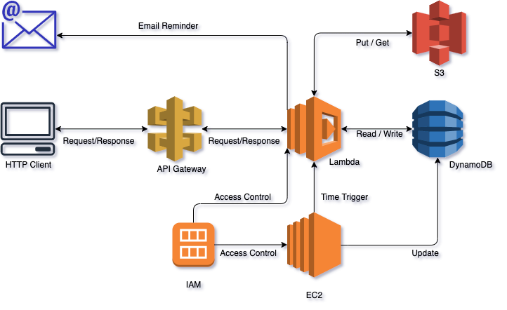
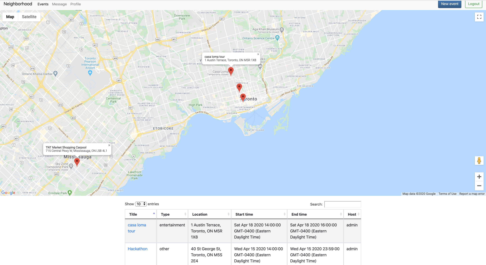
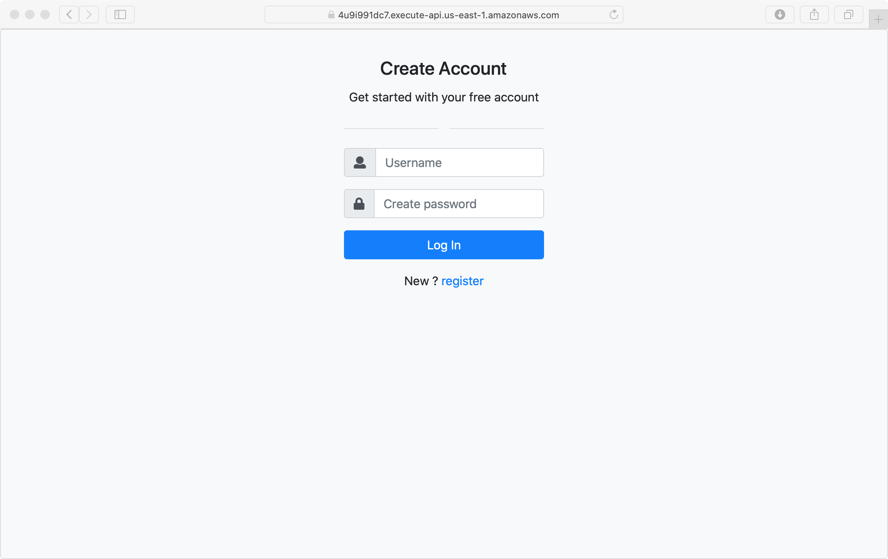
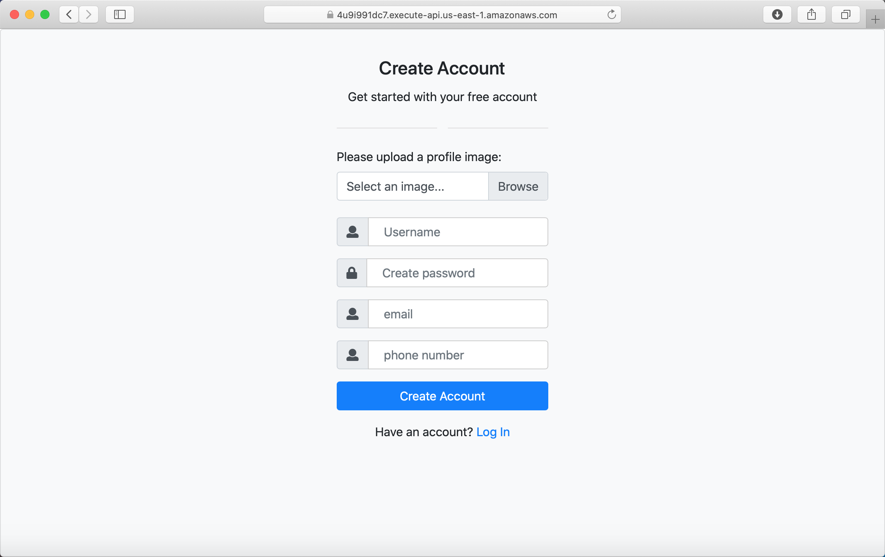
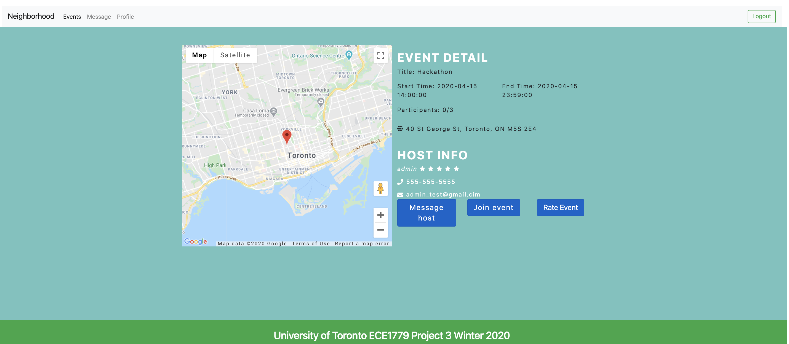
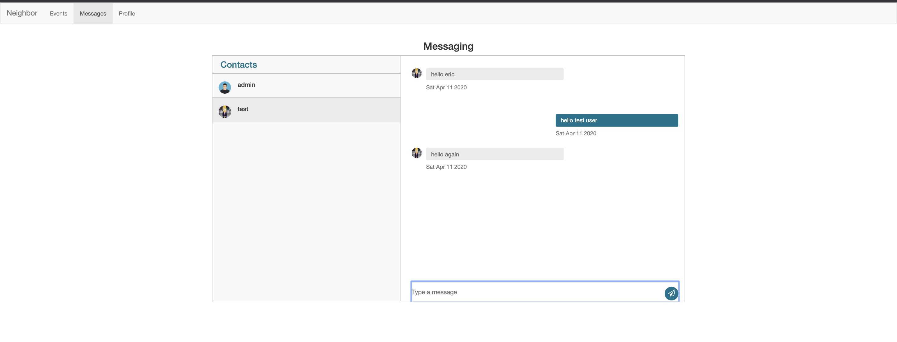

# Neighborhood Event Management Web Application

## Group members
* Hongyu Liu    
* Ran Wang    
* Zixiang Ma   

## Description of the application
This application intends to help people deepen their connections with others in the neighborhood. Sometimes, we want to play basketball while there's no teammates. People who feel lonely in the neighborhood may need company for a walk or a meal. Research has shown that loneliness is found throughout society, including among people in marriages along with other strong relationships, and those with successful careers. Therefore, this application aims to create opportunities for people in the neighborhood to connect with each other and have fun during the activities.

People can post events on this website as hosts, they can also join others' events. The events could be sports, entertainment, or daily routines like walking a dog. There's a map on the website that shows where the events are taking place at, which makes it convenient for people to look for the events that are close to them. Once they are interested, they can view the event details and go through the host's profile where shows the ratings of the events that the host has hosted before. They are able to leave messages for the host if they have questions or comments. They could also rate the event they joined after it finished. 

This application is helpful for those who want to have some connections with others while do not have many friends. It makes sense to join an event in the neighborhood since people would not have to drive a long way for an activity. This application allows users to communicate with hosts and to view the ratings of hosts' past events, which helps ensure that people could join the proper events. Hopefully, people can live a more colorful and happier life by attending the amazing events they shared with others on the website.

## Quick Start

### project structures
~~~
ece1779-a3
├── SendEmail                   # Lambda function for email notification
│   └── app
├── figures                     # Documentation
├── neighbor                    # Lambda function for the Neighbor application
│   └── app
│       ├── static
│       │   ├── favicon
│       │   ├── scripts
│       │   └── styles
│       └── templates
└── scheduler                   # background process
~~~
### Set up virtual environment
~~~
python -m venv venv
source venv/bin/activate
~~~
### Install requirements and dependencies
~~~
pip install -r requirements.txt
~~~
### Initialize Zappa settings
~~~
zappa init
~~~
This initializes zappa_settings.json
~~~
{
    "dev": {
        "app_function": "app.webapp",
        "aws_region": "us-east-1",
        "profile_name": "default",
        "project_name": "ece1779-a3",
        "runtime": "python3.8",
        "s3_bucket": "zappa-zb30x62ln",
        "keep_warm":false
    }
}
~~~

### Deploy lambda function 
For first-time deploy
~~~
zappa deploy dev
~~~
For updates
~~~
zappa update dev
~~~

## Architecture of the application

Overall, this application consists of six AWS services for networking, computation and storage function as they are listed below. From a functional perspective, this application is made of two components: web services and background process.   
- Computation: Lambda, EC2
- Network: API Gateway
- Storage: DynamoDB, S3
- Security: IAM

### Application and AWS Lambda
The WSGI-compatible Python application 'neighbor' provides the interface with users and is deployed on AWS Lambda service as a serverless application. The lambda function accept and respond to HTTP request dispatched from API Gateway. The lambda function is able to access S3 and DynamoDB for storage. Email notification will be triggered periodically by the background scheduler to reminder users' upcoming events. IAM services grant proper access to lambda function and the EC2 instances to ensure they can interact with necessary services.

### Background process
There is a scheduler that is deployed on EC2 and scheduled to run every 5 minute and triggers event notification and garbage collection functions.

- Event notification: Scheduler would trigger an lambda function, which would check the DynamoDB to see if there is any event to be started within one hour. If there is, this lambda function will send email notifications to all participants and host.

- Garbage collection: Scheduler would check the DynamoDB to see if there is any event passes its scheduled time and no longer active. It there is, update the database to change the status to be inactive as a soft delete.

### Functions and user interfaces
 

The main page presents events locations on a map and basic events information in a table. Users are able to select how many event entries to show on this page and search events by key words. Users can sort the events in the table by title, type, location, start time, end time and host through clicking the arrows in the header.

 

Users can create an event by entering the information of it, like title, type, location, number of participants required, start time and end time.

Users are required to login before they can make any further operations.

If users are new to the application, they need to register first. They can register without a profile image, in that case, the default one will be used.

 

Click the title of the event on the main page will lead to the page that shows event details. Users can see the location on the map, view event details and host information. They can also click the buttons to leave a message to the host, join the event and rate the event.

If users click the button "Message host" on the page that shows event details, they will be led to the message page where there's a contact list on the left and history messages with that host on the right. If users click 'Message' on the navigation bar, the message page will only show the contact list. Once a contact is chosen, the messages on the right will be refreshed.

The profile page shows user's information and the events that the user has hosted and joined. Users are able to drop events that they do not prefer any more. 

### Background process

#### Event notifications
For any event that is scheduled to be held within one hour, this application would automatically send emails to all participants and host. Users would be specifically notified the event title they signed up for and the scheduled time. 

#### Garbage collection
For any event that its start time has passed, the status is updated to be inactive as a soft delete. These events won't be displayed to users anymore.

## Cost model for AWS costs
In this section, we will model the AWS operation cost given a certain scale of user base. We decompose the cost into static cost and dynamic cost. Static cost is incurred maintaining the service alive and regardless of volume of traffic to our application. Dynamic cost is incurred for operation such as database read/write, and it increases dramatically with the number of request processed. As different AWS service imposes varies pricing policy, we will model the cost separately by each service we used and concluded the total cost by summing it up.  
### Static Cost
- EC2: $0
  - Free tier is enough to run the scheduler. AWS Free Tier includes 750 hours of Linux and Windows t2.micro instances each month for one year. 
- S3: $2.3 for 1000,000 users per month
  - Use S3 standard, the cost is 0.023 per GB for first 50 TB in a Month. In this application, S3 is only used to store user's profile image. Suppose 1 image is 100 KB on average. 10 images are 1e-5 GB, almost 0 dollars. 1000 images are 0.001 GB, which is also almost 0 dollars. 1000,000 images are 100 GB, that is 2.3 dollars.
- DynamoDB: 10 KB per 100 items; 22 items per user per month
  - Use AWS DynamoDB Free Tier, first 25 GB of data storage per month is free, 0.25 per GB thereafter. DynamoDB stores users information, events information and messages. 100 items in DynamoDB takes around 10 KB.
- DynamoDB Backup: $0.20 per GB a month for continuous backup; 10 KB per 100 items; 22 items per user per month
  - 10 users: $0
  - 1000 users: $0
  - 1000,000 users: $2.64
- Lambda: $21.6 per month 
  - Use 512 MB for memory, which costs $0.0000008333 per 100ms. $0.0000008333 * 10 * 3600 * 24 * 30 = $21.6

### Dynamic Cost Policy
- S3: $0.005 per 1000 POST and $0.0004 per 1000 GET requests
- DynamoDB: $0.25 per 1 million read request units; $1.25 per 1 million write request units. An eventually consistent read request requires one-half read request unit.
- Lambda: $0.20 per 1M requests
- API Gateway: $1.00 per million for the first 300 million, $0.90 per million thereafter 

### Dynamic Modeling
#### S3
Each user has 1 POST request when they register. A user only requests for a profile image when they leave messages to others and view profile page. We assume that a user will have 30 GET requests per month.
- For 10 users: 10 * $0.005 + 10 * 30 * $0.0004 = $0.17
- For 1000 users: 1000 * $0.005 + 1000 * 30 * $0.0004 = $17
- For 1000,000 users: 1000,000 * $0.005 + 1000,000 * 30 * $0.0004 = $17000

#### DynamoDB
- We approximate the number of read request to DynamoDB generated by a single user per month. Based on the our approximation listed below we concluded 17,465 read requests per month per user; 
  - Search events: 30 per month per user
  - View event details: 60 per month per user
  - View messages: 30 per month per user
  - View profile user info: 30 per month per user
  - View profile history events: 30 per month per user
  - Login: 5 per month per user
  - Reminder: 1 per 5 minute
  - Garbage collection: 1 per 5 minute
- Based on the same methodologies we conclude 744 write requests per month per user   
  - Create events: 3 per month per user
  - Join events: 5 per month per user
  - Drop events: 2 per month per user
  - Rate events: 3 per month per user
  - Leave messages: 10 per month per user
  - Register: 1 per user
  - Garbage collection: 1 per hour

#### Lambda
we approximated 18,209 requests per month per user based on the assumption below. 
- Search events: 30 per month per user
- View event details: 60 per month per user
- View messages: 30 per month per user
- View profile user info: 30 per month per user
- View profile history events: 30 per month per user
- Login: 5 per month per user
- Reminder: 1 per 5 minute
- Garbage collection: 1 per 5 minute
- Create events: 3 per month per user
- Join events: 5 per month per user
- Drop events: 2 per month per user
- Rate events: 3 per month per user
- Leave messages: 10 per month per user
- Register: 1 per user
- Garbage collection: 1 per hour

#### API Gateway
we approximated the same number of requests as Lambda requests, that is 18,209 requests per month per user. 

### Cost Approximation
- 6 month for 10 users
  - Static: $129.6
  - Dynamic: $0.17 + $0.39 + $0.06 + $0.22 = $0.84
  - Sum: $130.44

- 6 month for 1000 users
  - Static: $129.6
  - Dynamic: $17 + $39.3 + $5.58 + $21.85 + $0.36 = $84.09
  - Sum: $213.69

- 6 month for 1000,000 users:
  - Static: $2.3 + $160.5 + $2.64 + $129.6 = $295.04
  - Dynamic: $17000 + $39296.25 + $5580 + $21850.8 + $364.18 = $84091.23
  - Sum: $84,386.27
